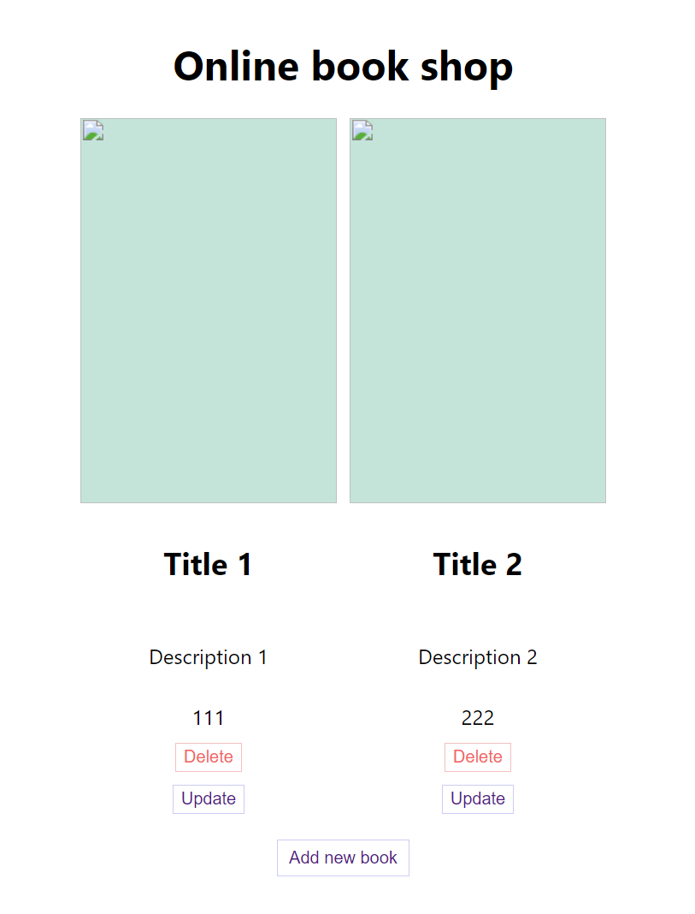

# BookDB
- A basic React Node.js MySQL website to showcase CRUD operations, using npm / yarn as a package manager,
express app as middleware and axios for REST requests

## To run
- The app uses a local database connection with the properties found in `backend/index.js` (one could test the connection with a basic `get` request at `http://localhost:8800/`)
- The database should have a `test` schema contains a `books` tabel, with `id` (PK), `title`, `desc`, `price`, `cover` - all `NOT NULL` and with corresponding data types 
- Setup dependencies in both the `backend` and `client` folders by setting up `yarn`
- Run both the server and the client using `yarn start`
- The user can add new books, delete or update existing ones (image support is not implemented)

